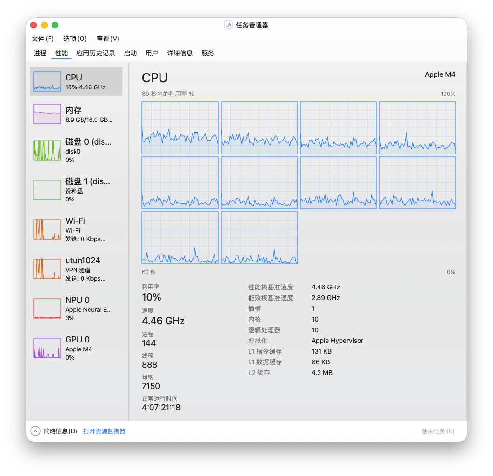

### 任务管理器，但是macOS ###

### Taskmanager, but on macOS ###

最低支持版本 macOS 26.0 Intel + Apple Silicon

Support for macOS 26, Intel and Silicon hosts.

支持中英文切换 (选项-语言-中/英文)

U can change language whether u want. (SimpCHN or enUS)

主要特征： 深色浅色自动切换 以及和Windows 10 任务管理器几乎一致的界面和交互。

Main features: automatic switching between dark and light modes, and an interface and interactions almost identical to Windows 10 Task Manager.

说明：NPU 页面的性能曲线 是结合 ANE (Apple Neural Engine) 可读取的 neural footprint 的变化趋势结合CPU、GPU整体利用率加权出来的估算值。(我不知道这样估算是否合理以及有什么依据，但是图一乐嘛)

Note: The performance curve on the NPU page is an estimated value derived by combining the trend of the neural footprint readable by the ANE (Apple Neural Engine) with the overall utilization of the CPU and GPU. (I don’t know if this estimation is reasonable or what the basis is, but it looks fun in the chart)

最后，这只是一个初始工程，不打算一直更新。

At last, I did it just for fun. I don't promise to keep releasing updated versions.

**部分代码由AI生成，如果您认为涉及抄袭或者剽窃，请直接提issues。** 

**Some of the code is AI-generated. If you think it involves plagiarism or copying, just write an issue.**
